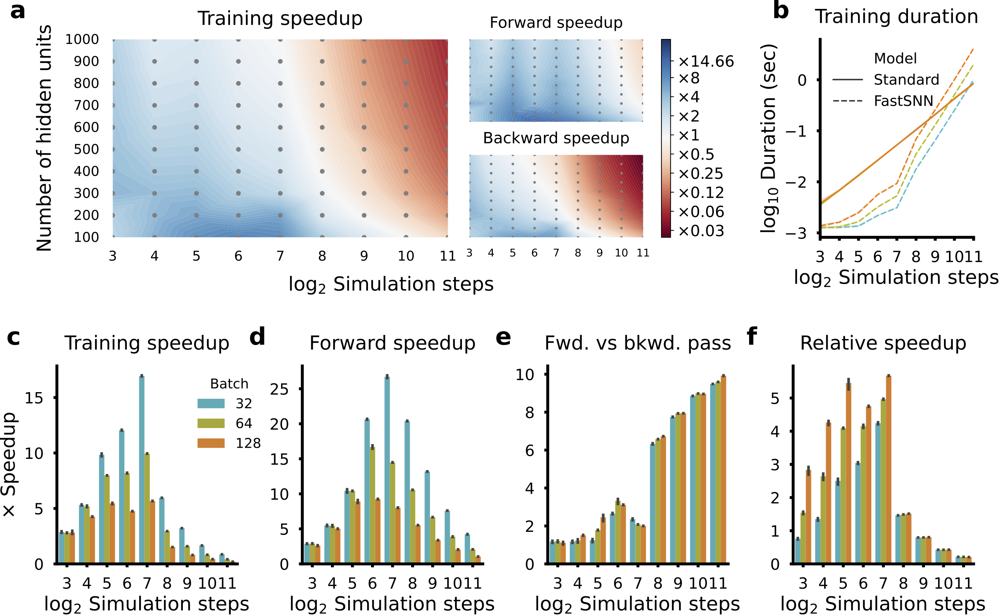
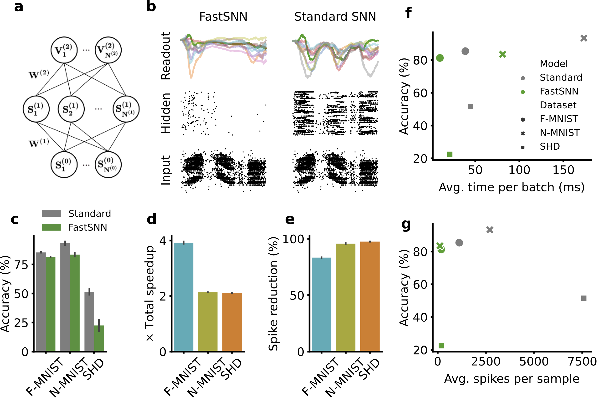

# Accelerating spiking neural network training

A new method for training single-spike-per-neuron SNNs which is drastically faster than conventional SNNs and obtain competitive results on datasets of low to medium spatio-temporal complexity with a significant reduction in spike counts.

## Installing dependencies

Install all required dependencies and activate the fastsnn environment using conda.
```
conda env create -f environment.yml
conda activate fastsnn
```

## Model benchmarking and training

For all experiments make sure to cd into the scripts directory `cd scripts`.

### Running benchmark experiments

This script will benchmark the time of the forward and backward passes of the FastSNN and standard SNN model for different numbers of neurons and simulation steps.
```
python run_benchmarks.py
```

### Training models

Ensure that the computer has a CUDA capable GPU with CUDA 11.0 installed. 

#### 1. Downloading and processing datasets

The Fashion-MNIST dataset will be downloaded by PyTorch by default. The content of the Neuromorphic-MNIST dataset can be [downloaded](https://www.garrickorchard.com/datasets/n-mnist) and unzipped into the `data/N-MNIST` directory. Thereafter, the following script (taken from Perez-Nieves et al., 2021) needs to be run which processes the raw dataset. 
```
python convert_nmnist2h5.py
```
Finally, the Spiking Heidelberg Digits (SHD) dataset can be [downloaded](https://compneuro.net/posts/2019-spiking-heidelberg-digits/) and unzipped into the `data/SHD` directory.

#### 2. Train model

You can train the standard SNN and FastSNN on the different datasets using the train.py script. The following hyperparameters were used for training on the Fashion-MNIST and Neuromorphic-MNIST datasets. All hyperparameters remained the same for training on the SHD dataset, except for the time update step, epoch count and learning rate `--dt 2 --epoch 200 --lr 0.001`.

```
python train.py 
--n_hidden 200
--fast_layer True
--hidden_tau 10
--readout_tau 20
--dt 1
--dataset fmnist
--epoch 150
--batch_size 128
--lr 0.0002
```

## Building results

All speedup and training results can be built by running the notebooks/benchmark_results.ipynb and notebooks/dataset_results.ipynb notebooks. Pretrained models can be downloaded from Google Drive and unzipped into the results directory.

### Speedup results


Speedup of the FastSNN over the standard SNN model for a single layer. **a.** Speedups as a function of the number of layer units and number of simulation steps for the total training step and the individual forward and backward passes (using a batch size b=128). **b.** Training durations for both models. Figures **b**-**f** use a layer with n=200 units and are a 10 sample average for which the mean and s.d. is plotted. **c.** Total training speedup of the FastSNN model. **d.** Forward pass speedup of the FastSN model. **e.** Forward vs the backward pass speedup of the FastSNN model. **f.** Relative speedup of the FastSNN using different batch sizes relative to the standard SNN using a fixed batch size b=128.

### Dataset results


The classification performance and speedup of training the FastSNN on real datasets. **a.** Illustration of the network architecture used for training. **b.** Snapshot of the network activity after training of the FastSNN and standard SNN model in response to a sample from the N-MNIST dataset. Bottom: Spike raster of input sample. Middle: Spike raster of hidden unit activity. Top: Membrane potentials of the readout units (dark green line is the readout unit corresponding to the correct class). **c.** Classification accuracies of the FastSNN and standard SNN for the different datasets. Bar plots **c**-**e** represent a 6 sample mean with s.d.. **d.** Total training speedup of the FastSNN compared to the standard SNN for the different datasets. **e.** Spike count reduction of the FastSNN compared to the standard SNN on the different datasets. **f.** Model performance vs the average processing time of a training batch (b=128). **g.** Model performance vs the average number of spikes elicited per sample.