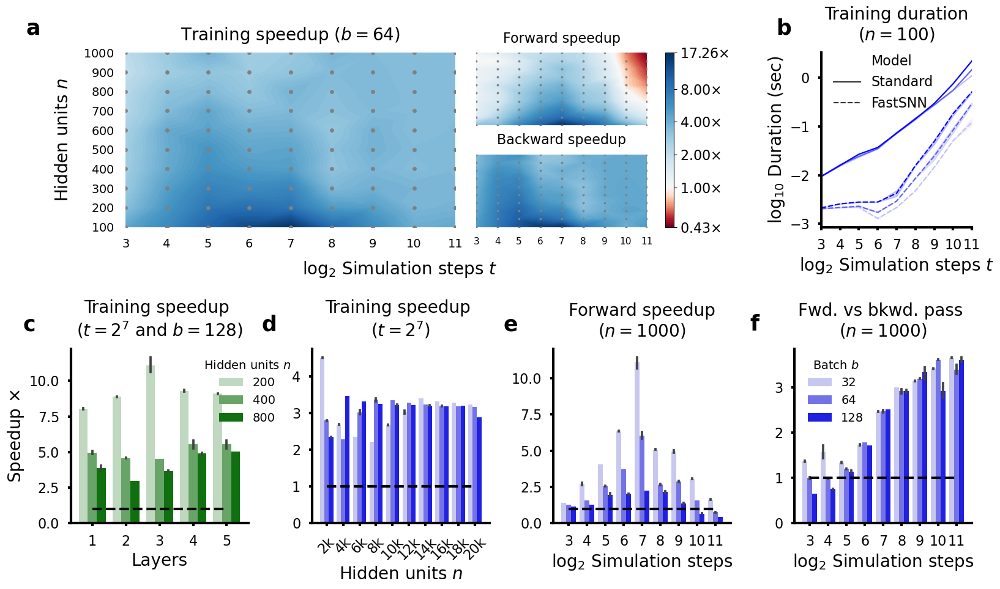

# The single-spike block model

A new model for robust and accelerated training of single-spike spiking neural networks (SNNs) with competitive performance across various image and neuromorphic datasets. This is the accompanying repository to the paper [Robust and accelerated single-spike spiking neural network training with applicability to challenging temporal tasks](https://arxiv.org/abs/2205.15286).


## Installing dependencies

Install all required dependencies and activate the block environment using conda.
```
conda env create -f environment.yml
conda activate block
```

## Getting started tutorial

See the [notebooks/Tutorial.ipynb](../notebooks/Tutorial.ipynb) notebook for getting started with the block model.

## Reproducing paper results

All the paper results can be reproduced using the scripts available in the `scripts` folder. Alternatively, all speedup benchmarks and pretrained models can be found under the releases.

### Running benchmark experiments

The `python run_benchmarks.py` script will benchmark the time of the forward and backward passes of the block and standard single-spike SNN model for different numbers of neurons and simulation steps.

### Training models

Ensure that the computer has a CUDA capable GPU with CUDA 11.0 installed. 

#### 1. Downloading and processing datasets

The Fashion-MNIST dataset will be downloaded by PyTorch by default. The content of the Neuromorphic-MNIST dataset can be [downloaded](https://www.garrickorchard.com/datasets/n-mnist) and unzipped into the `data/N-MNIST` directory. Thereafter, the `python convert_nmnist2h5.py` script (taken from Perez-Nieves et al., 2021) needs to be run which processes the raw dataset. Finally, the Spiking Heidelberg Digits (SHD) dataset can be [downloaded](https://compneuro.net/posts/2019-spiking-heidelberg-digits/) and unzipped into the `data/SHD` directory.

#### 2. Train model

You can train the block and standard single-spike SNN on the different datasets using the train.py script. As an example, see the `scripts/run_robustness.py` script.


## Building result figures

All speedup and training results can be built by running the `notebooks/results/benchmark_results.ipynb` and `notebooks/results/dataset_results.ipynb` notebooks. The code for the other paper figures can be found under `notebooks/figures` directory.

### Speedup results


Training speedup of our model over the standard model. **a.** Total training speedup as a function of the number of hidden neurons $n$ and simulation steps $t$ (left), alongside the corresponding forward and backward pass speedups (right). **b.** Training durations of both models for fixed hidden neurons $n=100$ and variable batch size $b$. **c.** Training speedup over different number of layers for fixed time steps $t=2^7$ and batch size $b=128$. **d.** Training speedup over large number of hidden neurons $n$ for fixed time steps $t=2^7$ and variable batch size $b$. **e.** Forward pass speedup for fixed time steps $t=2^7$ and variable batch size $b$. **f.** Forward vs the backward pass speedup of our model for fixed time steps $t=2^7$ and variable batch size $b$. **b-f** use a $10$ sample average with the mean and s.d. plotted.

### Dataset results


Analysis of our models performance on real datasets. **a.** Difference in accuracy between the standard multi-spike and our model. **b.** Training speedup of our model vs the standard single-spike model. **c.** Reduction in spikes of our single-spike model vs the standard multi-spike model (**a-c** use a $3$ sample average with the mean and s.d. plotted). **d.** Training robustness of our model to solve different datasets when starting with zero network activity, which is fatal to other single-spike training methods. Top panel: Normalised training loss over time. Bottom panel: Normalised network activity over time, where the red cross denotes the absence of any spikes.